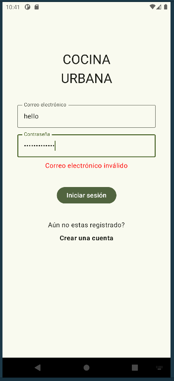
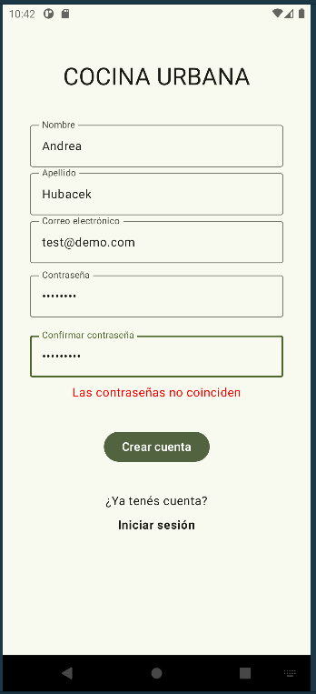
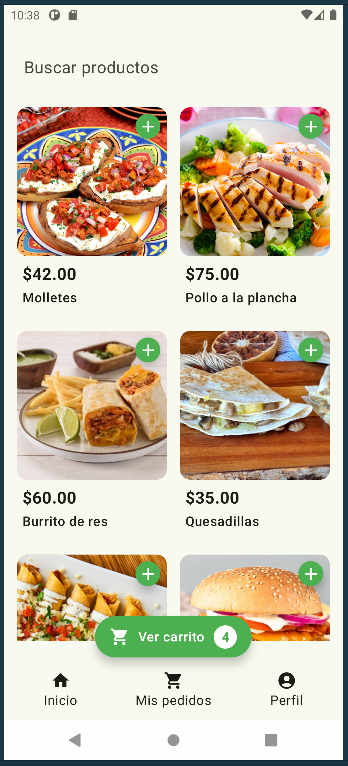
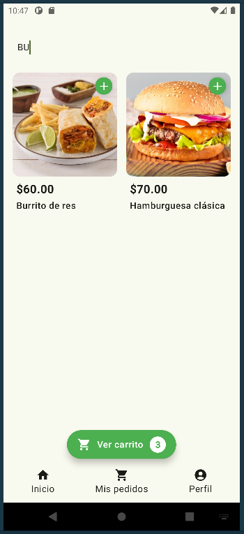
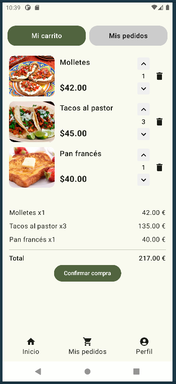
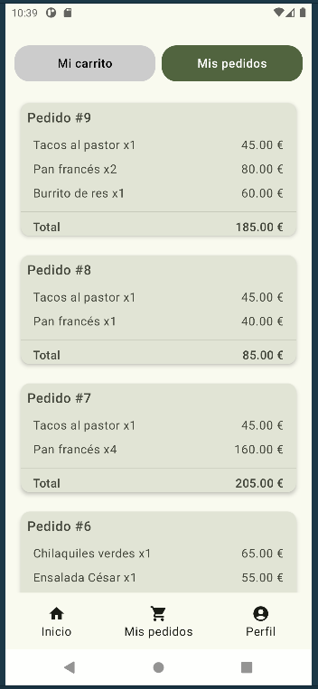
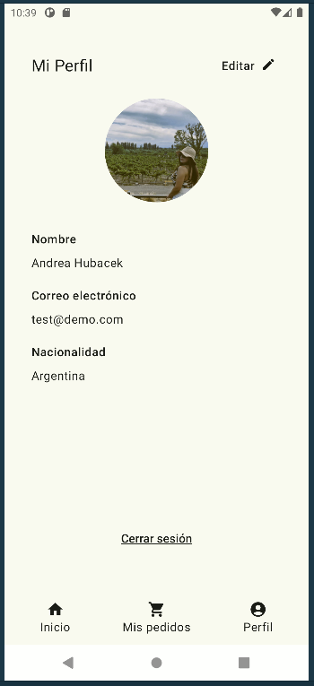
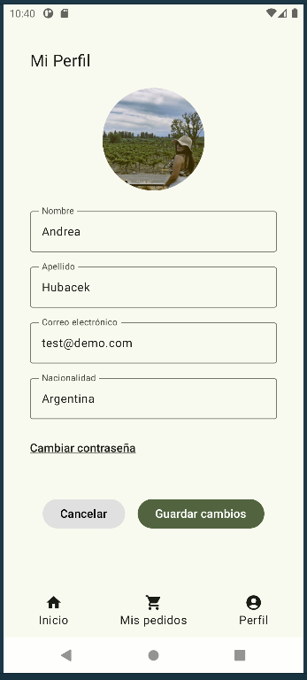

# PeyaDemoApp

A modern mobile quick commerce application built with Kotlin, Hilt, Jetpack Compose, Retrofit and
Room. The app allows users to select products, add them to the cart, modify quantities, confirm the
purchase, and view an order summary.
Includes login, registration, and a user profile where users can edit their information and profile
picture. The cart persists in local storage, and there is worker that synchronizes the products
periodically.

## ✨ Features

- Login
- Registration
- Products Screen
- Floating Cart
- Cart Screen
- Orders History
- User Profile

## ⚙️ Environment setup

Before running the app, make sure to set the following environment variables in your
local.properties file at the root of the project:

- `API_BASE_URL` = Use the API
  from [this repository](<https://github.com/anhubacek/PeyaDemoAppAPI>)
  or https://peyademoappapi-kad2.onrender.com/
- `CLOUDINARY_CLOUD_NAME`=
- `CLOUDINARY_API_KEY`=
- `CLOUDINARY_API_SECRET`=
- `CLOUDINARY_PRESET_NAME`=

Replace the values with your own keys.

## 📸 Screenshots

